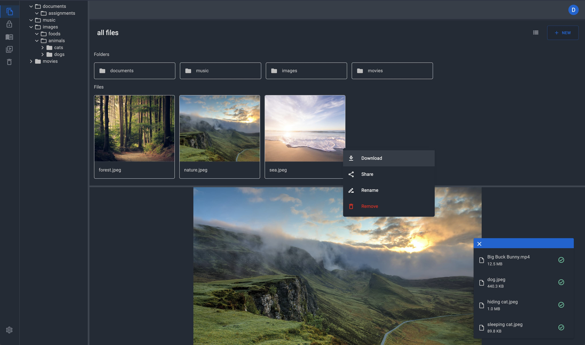

<h1 align="center">iremono</h1>



iremono is a self-hosted cloud storage built with node js and react both of which are powered by typescript. iremono means **a container that can hold anything** in Japanese. It has been developed with the purpose of allowing people to manage their own personal data by themselves including myself in trusted environment such as Raspberry Pi. Every file will be encrypted with a encryption key generated by the user. The server will not store the key in the database, guaranteeing that your files are securely stored. You can explore the repository easily from here => [go explore iremono](https://github1s.com/ryuichi24/iremono).

## Demo

There is demo to play around with: [iremono demo](https://iremono.herokuapp.com/)

\*The demo account does not have any write access.

## How to run iremono

### Clone repo

```bash
git clone https://github.com/ryuichi24/iremono.git && cd iremono
```

### Install dependencies

```bash
yarn install
```

### Make env file

```bash
yarn make-prod-env-file
```

```txt
HOST=
PORT=5555
SECURE_COOKIE=false

LOGGING_MIN_LEVEL=1

# secret for access token
JWT_SECRET_FOR_ACCESS_TOKEN=6de0ed2016381b13b3728372e4a55fe2

# expiry for the access token
JWT_EXPIRE_IN_FOR_ACCESS_TOKEN=900000

# expiry for the refresh token
EXPIRE_IN_FOR_REFRESH_TOKEN=86400000

# expiry for the download file token
EXPIRE_IN_FOR_DOWNLOAD_FILE_TOKEN=3600000

# expiry for the stream file token
EXPIRE_IN_FOR_STREAM_FILE_TOKEN=86400000

# name for media directory
MEDIA_DIR_NAME=iremono_media

# directory/folder path where all files and thumbnails are saved encrypted
PATH_TO_MEDIA_DIR=../..

# encryption key to encrypt files and thumbnails
ENCRYPTION_KEY=543ab2e09c827998eb150526e42ea938

# encryption key to encrypt client encryption key
ENCRYPTION_KEY_FOR_CLIENT_ENCRYPTION_KEY=627b887ad683e569bc37c4b1e98156b4

# currently support "mysql" and "sqlite"
DB_TYPE=sqlite

# credentials for database
DB_HOST=
DB_USERNAME=
DB_PASSWORD=

# if sqlite selected, path and the database file name
DB_NAME=../../iremono.db
```

### Initialize database

#### SQLite

```bash
yarn init-sqlite-db-prod
```

#### MySQL

```bash
yarn init-mysql-db-prod
```

### Build the project

```bash
yarn build
```

### Start the project

```bash
yarn start
```

## How to run iremono for development

You just take exactly the same steps to ["Install dependencies"](#install-dependencies) and do the following.

### Make env file

```bash
yarn make-dev-env-file
```

### Initialize database

#### SQLite

```bash
yarn init-sqlite-db-dev
```

#### MySQL

```bash
yarn init-mysql-db-dev
```

### Run iremono

#### Run both backend and frontend

```bash
yarn dev
```

#### Run only api server

```bash
yarn dev-server
```

## Credit to

sleeping cat.jpeg: Photo by <a href="https://unsplash.com/@michaelsum1228?utm_source=unsplash&utm_medium=referral&utm_content=creditCopyText">Michael Sum</a> on <a href="https://unsplash.com/s/photos/cat?utm_source=unsplash&utm_medium=referral&utm_content=creditCopyText">Unsplash</a>

hiding cat.jpeg: Photo by <a href="https://unsplash.com/@miklevasilyev?utm_source=unsplash&utm_medium=referral&utm_content=creditCopyText">Mikhail Vasilyev</a> on <a href="https://unsplash.com/s/photos/cat?utm_source=unsplash&utm_medium=referral&utm_content=creditCopyText">Unsplash</a>

nature.jpeg: Photo by <a href="https://unsplash.com/@v2osk?utm_source=unsplash&utm_medium=referral&utm_content=creditCopyText">v2osk</a> on <a href="https://unsplash.com/s/photos/nature?utm_source=unsplash&utm_medium=referral&utm_content=creditCopyText">Unsplash</a>

forest.jpeg: Photo by <a href="https://unsplash.com/@szmigieldesign?utm_source=unsplash&utm_medium=referral&utm_content=creditCopyText">Lukasz Szmigiel</a> on <a href="https://unsplash.com/s/photos/forest?utm_source=unsplash&utm_medium=referral&utm_content=creditCopyText">Unsplash</a>

sea.jpeg: Photo by <a href="https://unsplash.com/@frankiefoto?utm_source=unsplash&utm_medium=referral&utm_content=creditCopyText">frank mckenna</a> on <a href="https://unsplash.com/s/photos/sea?utm_source=unsplash&utm_medium=referral&utm_content=creditCopyText">Unsplash</a>

hungry dog.jpeg: Photo by <a href="https://unsplash.com/@barkernotbaker?utm_source=unsplash&utm_medium=referral&utm_content=creditCopyText">James Barker</a> on <a href="https://unsplash.com/s/photos/dog?utm_source=unsplash&utm_medium=referral&utm_content=creditCopyText">Unsplash</a>

Big Buck Bunny.mp4: https://www.youtube.com/watch?v=YE7VzlLtp-4

sample.pdf: http://www.africau.edu/images/default/sample.pdf

sample.mp3: https://file-examples.com/index.php/sample-audio-files/

sample.doc: https://file-examples.com/index.php/sample-documents-download/sample-doc-download/
